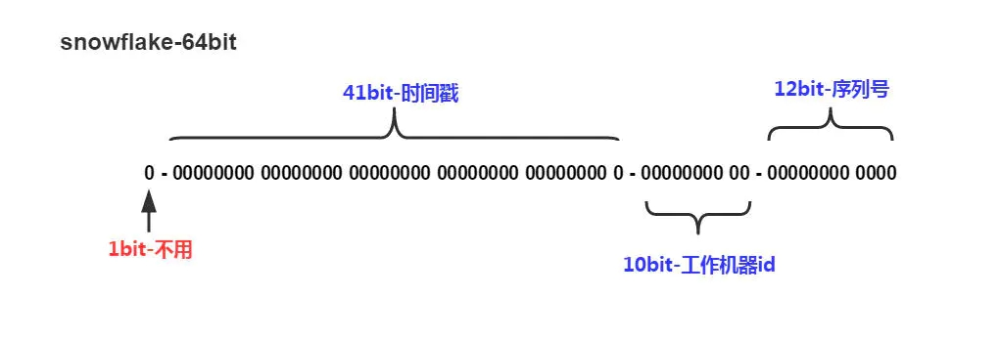

# 算法原理

## 传统雪花算法

  传统 SnowFlake 算法生成id的结果是一个 64bit 大小的整数，它的结构如下图：：

- 首位无效符：第一个 bit 作为符号位，因为我们生成的都是正数，所以第一个 bit 统一都是 0。

- 时间戳：占用 41 bit ，精确到毫秒。41位最好可以表示2^41-1毫秒，转化成单位年为 69 年。

- 机器编码：占用 10 bit，其中高位 5 bit 是数据中心 ID，低位 5 bit 是工作节点 ID，最多可以容纳 1024 个节点。

- 序列号：占用 12 bit，每个节点每毫秒 0 开始不断累加，最多可以累加到 4095 ，一共可以产生 4096 个ID。

## 如何处理时间回拨

- 当发生系统时间回拨时，算法采用过去时序的预留序数生成新的ID。

- 回拨生成的ID序号，默认靠前，也可以调整为靠后。

- 允许时间回拨至本算法预设基数（参数可调）。