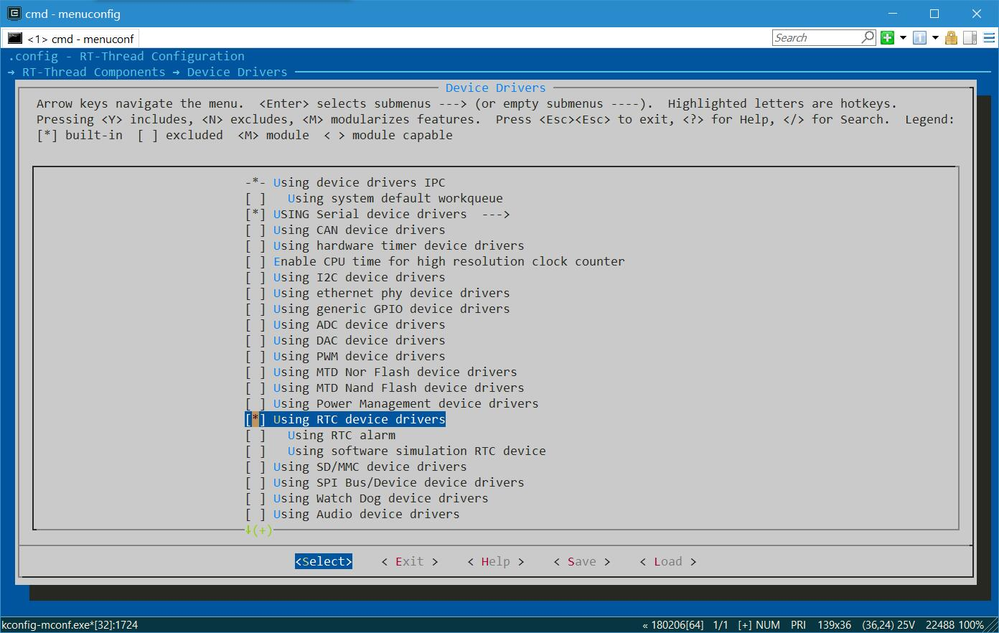
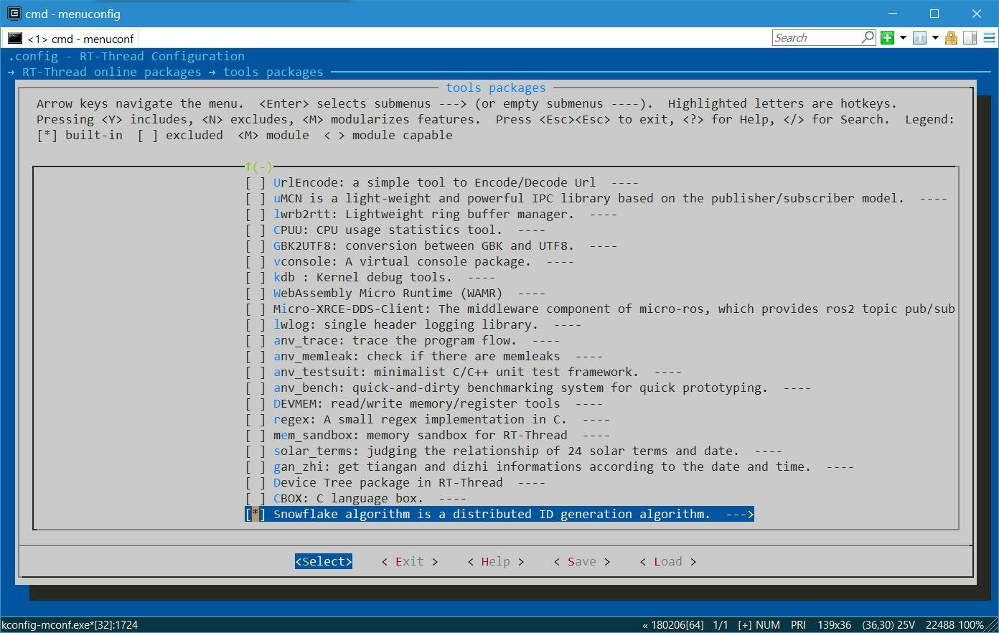

# 使用指南

本节主要介绍 SnowFlake 软包的基本使用流程， 并针对使用过程中经常涉及到的结构体和重要 API 进行简要说明。

## 准备工作

首先在 menuconfig 中启用 RTC 的功能，操作界面如下图所示：



详细配置介绍如下所示：

```shell
RT-Thread Components →
    Device Drivers:
        -*- Using RTC device drivers 
        [ ]   Using software simulation RTC device
```

然后下载 SnowFlake 软件包，并将软件包加入到项目中。在 BSP 目录下使用 menuconfig 命令打开 env 配置界面，在 `RT-Thread online packages → tools packages` 中选择 SnowFlake 软件包，操作界面如下图所示：



详细配置介绍如下所示：

```shell
RT-Thread online packages
	tools packages  --->
		[*] Snowflake algorithm is a distributed ID generation algorithm
		[ ]   Enable snowflake samples 
              Version (latest)  --->
```

**Enable snowflake samples** ：添加示例代码；

**Version** ：配置软件包版本号。

选择合适的配置项后，使用 `pkgs --update` 命令下载软件包并更新用户配置。

